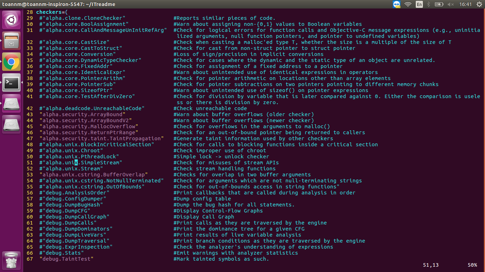

# Hardening plus Driected Fuzzing
## Introduction
### AFLGo: Directed Greybox Fuzzing
AFLGo is an extension of <a href="https://lcamtuf.coredump.cx/afl/" target="_blank">American Fuzzy Lop (AFL)</a>.
Given a set of target locations (e.g., `folder/file.c:582`), AFLGo generates inputs specifically with the objective to exercise these target locations.

Unlike AFL, AFLGo spends most of its time budget on reaching specific target locations without wasting resources stressing unrelated program components. This is particularly interesting in the context of
* **patch testing** by setting changed statements as targets. When a critical component is changed, we would like to check whether this introduced any vulnerabilities. AFLGo, a fuzzer that can focus on those changes, has a higher chance of exposing the regression.
* **static analysis report verification** by setting statements as targets that a static analysis reports as potentially dangerous or vulnerability-inducing. When assessing the security of a program, static analysis tools might identify dangerous locations, such as critical system calls. AFLGo can generate inputs that actually show that this is indeed no false positive.
* **information flow detection** by setting sensitive sources and sinks as targets. To expose data leakage vulnerabilities, a security researcher would like to generate executions that exercise sensitive sources containing private information and sensitive sinks where data becomes visible to the outside world. A directed fuzzer can be used to generate such executions efficiently.
* **crash reproduction**  by setting method calls in the stack-trace as targets. When in-field crashes are reported, only the stack-trace and some environmental parameters are sent to the in-house development team. To preserve the user's privacy, the specific crashing input is often not available. AFLGo could help the in-house team to swiftly reproduce these crashes.

You can find out further information about AFLGo at [here](https://github.com/aflgo/aflgo) 

### Lowfat: Lean C/C++ Bounds Checking with Low-Fat Pointers
LowFat is a new bounds checking system for the `x86-64` based on the idea *low-fat pointers*.  LowFat is designed to detect object *out-of-bounds* errors (OOB-errors), such as buffer overflows (or underflows), that are a common source of crashes, security vulnerabilities, and other program misbehavior.  LowFat is designed to have low overheads, especially memory, compared to other bounds checking systems.

The basic idea of *low-fat pointers* is to encode bounds information (size and base) directly into the native bit representation of a pointer itself. This bounds information can then retrieved at runtime, and be checked whenever the pointer is accessed, thereby preventing OOB-errors.  Low-fat pointers have several advantages compared to existing bounds checking systems, namely:

* *Memory Usage*: Since object bounds information is stored directly in pointers (and not is some other meta data region), the memory overheads of LowFat is very low.
* *Compatibility*: Since low-fat pointers are also ordinary pointers, LowFat achieves high binary compatibility.
* *Speed*: Low-fat pointers are fast relative to other bounds-checking systems.

You can find out further information about Lowfat at [here](https://github.com/GJDuck/LowFat)
### Hardening plus Directed Fuzzing
In Tsunami Project, we proposed to combine LowFat to AFLGo (we call it **Hardening plus Directed Fuzzing**) so that one can improve the performance of AFLGo

Here is the architecture of this tool

<p align="center">
  
</p>

Our tool consists four paths
  - Target provider: This part will produce the targets for our tool by using static analysis technical
  - Graph Extractor: This part will extract CG(s) and CFG(s) of subject
  - Binary Instrumentor: Based on targets and information from part 2, this part will instrument the binary file
  - Fuzzer: The last part will generate the test suite to direct to the targets

## Installation
**Note:** Before using our tool, you need to install all required package(s) and set up all related environment(s).
1) Install LLVM with Gold-plugin
```bash
LLVM_DEP_PACKAGES="build-essential make cmake ninja-build git subversion python2.7 binutils-gold binutils-dev"
sudo apt-get install -y $LLVM_DEP_PACKAGES

# Checkout

# Use chromium's clang revision
mkdir ~/chromium_tools
cd ~/chromium_tools
git clone https://chromium.googlesource.com/chromium/src/tools/clang
cd clang

LLVM_REVISION=$(grep -Po "CLANG_REVISION = '\K\d+(?=')" scripts/update.py)
echo "Using LLVM revision: $LLVM_REVISION"

cd ~ && wget http://releases.llvm.org/4.0.0/llvm-4.0.0.src.tar.xz
wget http://releases.llvm.org/4.0.0/cfe-4.0.0.src.tar.xz
wget http://releases.llvm.org/4.0.0/compiler-rt-4.0.0.src.tar.xz
wget http://releases.llvm.org/4.0.0/libcxx-4.0.0.src.tar.xz
wget http://releases.llvm.org/4.0.0/libcxxabi-4.0.0.src.tar.xz

tar xf llvm-4.0.0.src.tar.xz
tar xf cfe-4.0.0.src.tar.xz
tar xf compiler-rt-4.0.0.src.tar.xz
tar xf libcxx-4.0.0.src.tar.xz
tar xf libcxxabi-4.0.0.src.tar.xz

mv cfe-4.0.0.src ~/llvm-4.0.0.src/tools/clang
mv compiler-rt-4.0.0.src ~/llvm-4.0.0.src/projects/compiler-rt
mv libcxx-4.0.0.src ~/llvm-4.0.0.src/projects/libcxx
mv libcxxabi-4.0.0.src ~/llvm-4.0.0.src/projects/libcxxabi

# Build & install
mkdir -p ~/build-llvm/llvm
cd ~/build-llvm/llvm
cmake -G "Ninja" \
      -DLIBCXX_ENABLE_SHARED=OFF -DLIBCXX_ENABLE_STATIC_ABI_LIBRARY=ON \
      -DCMAKE_BUILD_TYPE=Release -DLLVM_TARGETS_TO_BUILD="X86" \
      -DLLVM_BINUTILS_INCDIR=/usr/include ~/llvm-4.0.0.src
ninja
sudo ninja install

mkdir -p ~/build-llvm/msan
cd ~/build-llvm/msan
cmake -G "Ninja" \
      -DCMAKE_C_COMPILER=clang -DCMAKE_CXX_COMPILER=clang++ \
      -DLLVM_USE_SANITIZER=Memory -DCMAKE_INSTALL_PREFIX=/usr/msan/ \
      -DLIBCXX_ENABLE_SHARED=OFF -DLIBCXX_ENABLE_STATIC_ABI_LIBRARY=ON \
      -DCMAKE_BUILD_TYPE=Release -DLLVM_TARGETS_TO_BUILD="X86" \
       ~/llvm-4.0.0.src
ninja cxx
sudo ninja install-cxx

# Pull trunk libfuzzer.
cd ~ && git clone https://chromium.googlesource.com/chromium/llvm-project/llvm/lib/Fuzzer libfuzzer

sudo cp ~/llvm-4.0.0.src/tools/sancov/coverage-report-server.py /usr/local/bin/

# Install LLVMgold into bfd-plugins
sudo mkdir /usr/lib/bfd-plugins
sudo cp /usr/local/lib/libLTO.so /usr/lib/bfd-plugins
sudo cp /usr/local/lib/LLVMgold.so /usr/lib/bfd-plugins

```

2) Install other prerequisite.

**Note**: some packages can be different if you use other subject. You need to install all prerequisite package(s) to compile your subject successful
```bash
sudo apt-get update
sudo apt-get install python-dev
sudo apt-get install python3
sudo apt-get install python3-dev
sudo apt-get install python3-pip
sudo apt-get install autoconf
sudo apt-get install automake
sudo apt-get install libtool-bin
sudo apt-get install python-bs4
sudo apt-get install libclang-4.0-dev
sudo pip3 install --upgrade pip
sudo pip3 install networkx
sudo pip3 install pydot
sudo pip3 install pydotplus
```
## Case study
### After all prerequisites are installed successful, you can start now.
1) Checkout source code
```bash
# Set path of tool
export AFLGO=/path/to/integrated/tool
# Checkout extended script, this one will help you to use our tool easier
git clone https://github.com/mtoan2111/Exttool.git
export EXT_TOOL=$PWD/Exttool
```
We deployed an extended tool which will help you to use our tool (Hardening + Directed Fuzzer) easier
```bash
Usage: aflgo.py [option]
Options:

  usage                        - alfgo.py usage
  gentarget [cmd]              - Compile subject and generate BBtarget
  gendistance [bin]            - Caculate distance from CGs and CFGs 
  aflgoenv                     - Rebuild AFLGo and set all related environments 
  hardenenv                    - Rebuild AFLGo and set all related environments under Hardening mode 
  runfuzzer [op] [path] [...]  - Run fuzzer 
```
** Options for runfuzzer **
```bash
  runfuzzer [ options ] -- /path/to/fuzzed_app [ ... ] 

  Required parameters:

  inDir         - input directory with test cases
  outDir        - output directory for fuzzer finding

  Directed fuzzing specific settings

  -z schedule   - temperature-based power schedules
                  {exp, log, lin, quad} (Default: exp)
  -c min        - time from start when SA enters exploitation
                  in secs (s), mins (m), hrs (h), or days (d))

  Execution control settings:

  -f file       - location read by the fuzzed program (stdin)
  -t msec       - timeout for each run (auto-scaled, 50 - 1000 ms
  -m megs       - memory limit for child process (50 MB)
  -Q            - use binary-only instrumentation (QEMU mode)

  Fuzzing behavior settings:

  -d            - quick & dirty mode (skips deterministic steps)
  -n            - fuzz without instrumentation (dumb mode)
  -x dir        - optional fuzzer dictionary (see README))

  Other stuff:

  -T text       - text banner to show on the screen
  -M / -S id    - distributed mode (see parallel_fuzzing.txt)
  -C            - crash exploration mode (the peruvian rabbit thing)
```
Now, Let's go to next step
2) Download subject (<a href="http://xmlsoft.org/" target="_blank">libxml2</a>)
```bash
# Clone subject repository
git clone git://git.gnome.org/libxml2
export SUBJECT=$PWD/libxml2
```
3) Create a temporary folder. This folder will contain all temporary file(s) while using our tool 
```bash
# Setup directory containing all temporary files
mkdir temp
export TMP_DIR=$PWD/temp
```
* Writes BBtargets.txt (e.g. changed statements in commit <a href="https://git.gnome.org/browse/libxml2/commit/?id=ef709ce2" target="_blank">ef709ce2</a>).
```bash
# Download commit-analysis tool
wget https://raw.githubusercontent.com/jay/showlinenum/develop/showlinenum.awk
chmod +x showlinenum.awk
mv showlinenum.awk $TMP_DIR

# Generate BBtargets from commit ef709ce2
pushd $SUBJECT
  git checkout ef709ce2
  git diff -U0 HEAD^ HEAD > $TMP_DIR/commit.diff
popd
cat $TMP_DIR/commit.diff |  $TMP_DIR/showlinenum.awk show_header=0 path=1 | grep -e "\.[ch]:[0-9]*:+" -e "\.cpp:[0-9]*:+" -e "\.cc:[0-9]*:+" | cut -d+ -f1 | rev | cut -c2- | rev > $TMP_DIR/BBtargets.txt
# Print extracted targets. 
echo "Targets:"
cat $TMP_DIR/BBtargets.txt
```
* Alternatively, the targets can be obtained via static analysis tool.
```bash
# Create result folder to contain all result files while using static analysis tool.
mkdir result
export RLT=$PWD/result
# Compile subject using static analysis tool to get all potential bugs
pushd $SUBJECT
  ./autogen.sh
  ./configure --disable-shared
  make -j$(nproc) clean
  $EXT_TOOL/aflgo.py gentarget make -j$(nproc) all
popd
```
**Note**:If you want to extract BBtargets via static analysis tool, you can execute the command line as follow:
```bash
 $EXT_TOOL/aflgo.py gentarget  <command>
    - <command>: the command line to compile your subject
```
For example,
```bash
 $EXT_TOOL/aflgo.py gentarget gcc -g -O3 -o subject subject.c
  - 'gcc -g -O3 -o subject subject.c': command line to compile the subject.
```
- If you don't declare output ```RLT``` directory, ```/tmp``` is output directory by default.
- We defined all the checkers including the description of each checker in the [staticAnalysis.sh](https://github.com/mtoan2111/Exttool/blob/af3a97b1c86ae94b35415e36df2659ee2cbe9a88/staticAnalysis.sh#L41) file.
- Thus, You can ```enable/disable``` any checkers as you want by opening [staticAnalysis.sh](https://github.com/mtoan2111/Exttool/blob/af3a97b1c86ae94b35415e36df2659ee2cbe9a88/staticAnalysis.sh#L41) file and ```comment/uncomment``` any defined checkers 
<p align="center">
  
</p>

4) **Note**: If there are no targets, there is nothing to instrument!
5) Generate CG and intra-procedural CFGs from subject (i.e., libxml2).
```bash
# Set aflgo-env
$EXT_TOOL/aflgo.py aflgoenv
# Once that command is executed, automatically, aflgo will be rebuilt, 
# and all related environment will be set then.

# Build libxml2 (in order to generate CG and CFGs).
# Meanwhile go have a coffee ☕️
export LDFLAGS=-lpthread
pushd $SUBJECT
   make -j$(nproc) clean
  ./configure --disable-shared
   make -j$(nproc) all
popd
# * If the linker (CCLD) complains that you should run ranlib, make
#   sure that libLTO.so and LLVMgold.so (from building LLVM with Gold)
#   can be found in /usr/lib/bfd-plugins
# * If the compiler crashes, there is some problem with LLVM not 
#   supporting our instrumentation (afl-llvm-pass.so.cc:540-577).
#   LLVM has changed the instrumentation-API very often :(
#   -> Check LLVM-version, fix problem, and prepare pull request.

# Test whether CG/CFG extraction was successful
$SUBJECT/xmllint --valid --recover $SUBJECT/test/dtd3

# Generate distance ☕️
$EXT_TOOL/aflgo.py gendistance xmllint

# Check distance file
echo "Distance values:"
head -n5 $TMP_DIR/distance.cfg.txt
echo "..."
tail -n5 $TMP_DIR/distance.cfg.txt
```
**Note**: to use gendistance option, you can execute the command line as follow:
```bash
$EXT_TOOL/aflgo.py gendistance <BIN_FILE>
   - <BIN_FILE>: binary file name 
```
6) Note: If `distance.cfg.txt` is empty, there was some problem computing the CG-level and BB-level target distance. See `$TMP_DIR/step*`.
7) Instrument subject (i.e., libxml2)
- Hardening tool supports several command line options that are listed below.
 Note that to pass an option to Hardening it must be preceded by `-mllvm` on the command-line, e.g. (`-mllvm -lowfat-no-check-reads`), etc.
 
  - `-lowfat-no-check-reads`: Do not OOB-check reads
  - `-lowfat-no-check-writes`: Do not OOB-check writes
  - `-lowfat-no-check-escapes`: Do not OOB-check pointer escape (of any kind)
  - `-lowfat-no-check-memset`: Do not OOB-check memset
  - `-lowfat-no-check-memcpy`: Do not OOB-check memcpy or memmove
  - `-lowfat-no-check-escape-call`: Do not OOB-check pointer call escapes
  - `-lowfat-no-check-escape-return`: Do not OOB-check pointer return escapes
  - `-lowfat-no-check-escape-store`: Do not OOB-check pointer store escapes
  - `-lowfat-no-check-escape-ptr2int`: Do not OOB-check pointer pointer-to-int escapes
  - `-lowfat-no-check-escape-insert`: Do not OOB-check pointer vector insert escapes
  - `-lowfat-no-check-fields`: Do not OOB-check field access (reduces the number of checks)
  - `-lowfat-check-whole-access`: OOB-check the whole pointer access `ptr..ptr+sizeof(*ptr)` as opposed to just `ptr` (increases the number and cost of checks).
  - `-lowfat-no-replace-malloc`: Do not replace malloc() with LowFat `malloc()` (disables heap protection)
  - `-lowfat-no-replace-alloca`: Do not replace stack allocation (`alloca`) with LowFat stack allocation (disables stack protection)
  - `-lowfat-no-replace-globals`: Do not replace globals with LowFat globals (disables global variable protection)
  - `-lowfat-no-check-blacklist blacklist.txt`: Do not OOB-check the functions/modules specified in `blacklist.txt`
  - `-lowfat-no-abort`: Do not abort the program if an OOB memory error occurs
- You can pass these option(s) via ```HARDENING``` evironment variable
```bash 
# Pass hardening option(s)
export HARDENING="-mllvm -lowfat-no-check-escape-call -mllvm -lowfat-no-check-escape-return -mllvm -lowfat-no-check-escape-store -mllvm -lowfat-no-check-escape-ptr2int -mllvm -lowfat-no-check-escape-insert"
#Set integrated tool environment via our script
unset CC CXX CFLAGS CXXFLAGS
$EXT_TOOL/aflgo.py hardenenv
# Once the command above is executed, AFLGo will be rebuilt under HARDENING MODE
# Clean and build subject with distance instrumentation ☕️
pushd $SUBJECT
  make clean
  ./configure --disable-shared
  make -j$(nproc) all
popd
```

# How to fuzz the instrumented binary
```bash
# Construct seed corpus
mkdir in
cp $SUBJECT/test/dtd* in
cp $SUBJECT/test/dtds/* in

# Run fuzzer
$EXT_TOOL/aflgo.py runfuzzer in out -m none -d $SUBJECT/xmllint --valid --recover @@
```
